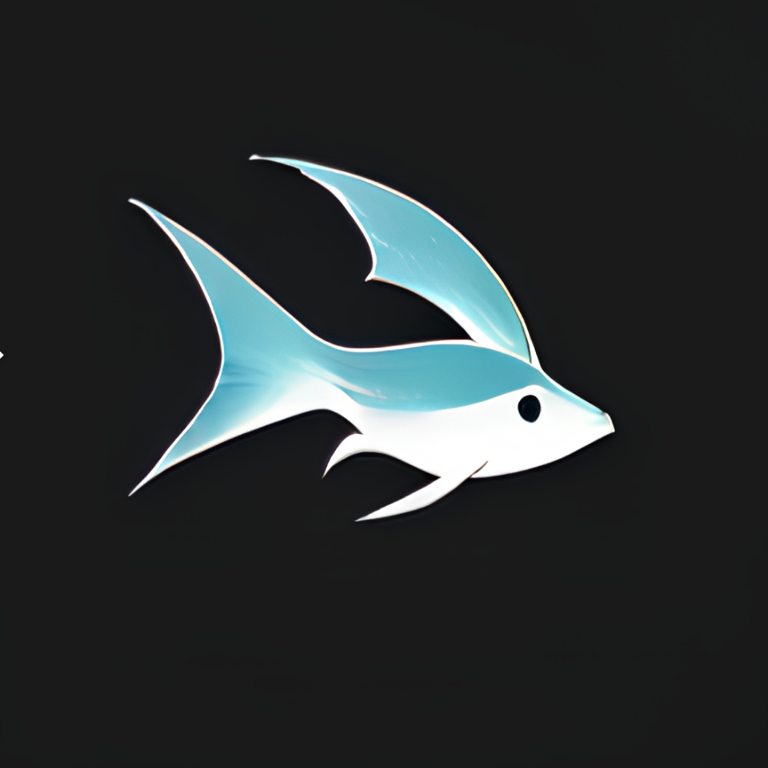

# GPT Shell

<div align="center">
  
  

  <h1>GPT Shell</h1>
  <p><strong>Your Professional Terminal Companion for LLM Interactions</strong></p>

  [](https://github.com/wangenius/gpt-shell/stargazers)
  [](https://github.com/wangenius/gpt-shell/blob/master/LICENSE)
  
  [](https://github.com/wangenius/gpt-shell/pulls)

  <p align="center">
    <a href="#-key-features">Features</a> •
    <a href="#-quick-start">Quick Start</a> •
    <a href="#-installation">Installation</a> •
    <a href="#-usage">Usage</a> •
    <a href="#-advanced">Advanced</a>
  </p>

</div>

## 🌟 Overview

GPT Shell transforms your terminal into a powerful interface for interacting with Large Language Models (LLMs). Built with performance and flexibility in mind, it seamlessly integrates with various AI providers while maintaining a simple, intuitive command-line interface.

Whether you're a developer seeking coding assistance, a writer looking for creative input, or a power user automating tasks, GPT Shell provides a streamlined experience for leveraging AI capabilities directly from your terminal.

## ✨ Key Features

<table>
<tr>
<td>

### 🔌 Core Capabilities
- **Universal Compatibility**: Works with any OpenAI API-compatible service
- **Multi-Model Support**: Switch between providers effortlessly
- **Custom Endpoints**: Configure your own API endpoints
- **Real-time Streaming**: Instant response display
- **Role Presets**: Quick-access bot personalities
- **Smart Aliases**: Single-character shortcuts

</td>
<td>

### 🎯 User Experience
- **Interactive Mode**: Natural conversation flow
- **Direct Queries**: Quick one-off questions
- **Color Output**: Enhanced readability
- **Context Retention**: Maintains conversation history
- **Generation Control**: Cancel anytime with Ctrl+C
- **Flexible Configuration**: Files and environment variables

</td>
</tr>
</table>

### 🤖 Supported Providers

- ✅ **OpenAI**
- ✅ **DeepSeek**
- ✅ **Tongyi**
- ✅ **ZhiPu**


## 🚀 Quick Start

### 📥 Installation

```powershell
# Windows PowerShell
irm https://raw.githubusercontent.com/wangenius/gpt-shell/refs/heads/master/install.ps1 | iex
```

### 💻 Basic Commands

```bash
# Start interactive session
gpt

# Quick question
gpt "What is the meaning of life?"

# Use specific role
gpt -b programmer "Review this code"

# Get help
gpt --help
```

## 📚 Usage Guide

### Interactive Mode
```bash
gpt
> Hello
Hello! How can I help you today?

> What is a closure?
A closure is a function that captures its environment...
[Press Ctrl+C to cancel generation]

> exit
Goodbye!
```

### Single Queries
```bash
# Direct questions
gpt "Explain Docker in simple terms"

# With specific role
gpt -bot programmer "What are design patterns?"

# Using aliases
gpt -p "Debug this error"
```

## ⚙️ Configuration

### Model Management
```bash
# Add new model
gpt config model add openai sk-xxxxxxxxxxxxxxxx

# Add custom model
gpt config model add deepseek your-api-key \
  --url https://api.deepseek.com/v1/chat/completions \
  --model deepseek-chat

# List & switch models
gpt config model list
gpt config model use deepseek
gpt config model remove openai
```

`--url` is full url, like `https://api.deepseek.com/v1/chat/completions` or `https://api.openai.com/v1/chat/completions`, not the base url like `https://api.openai.com/v1`.

### Role Management
```bash
# View all roles
gpt bots

# Add custom role
gpt bots add reviewer -s "You are an expert code reviewer"

# Manage aliases
gpt bots alias set reviewer r
gpt bots alias list
gpt bots alias remove r
```

### System Settings
```bash
# View configuration
gpt config

# Edit settings
gpt config edit

# Update system prompt
gpt config system "You are a professional developer"

# Toggle features
gpt config stream true
```

## 🔒 Security Best Practices

- **API Keys**: Store securely, never in version control
- **Access Control**: Manage permissions carefully
- **Cost Management**: Monitor API usage and limits
- **Data Privacy**: Be aware of data handling policies
- **Updates**: Keep the tool and dependencies current

## 🛠️ Development

### Building from Source
```bash
# Create optimized build
cargo build --release
```

### Configuration Storage
- Config files location: `~/.gpt-shell/`
- API keys stored securely
- Session history managed automatically

## 🤖 Agents System

GPT shell offered a powerful agents system, you can create and manage different roles of AI assistants. Each agent can execute specific tasks and commands.

### Agent Configuration

Each agent contains the following configuration:
  
```toml
name = "agent name"
description = "agent description"
system_prompt = "system prompt"

# Environment variables configuration
[env]
chrome = "C:\\Program Files\\Google\\Chrome\\Application\\chrome.exe"

# Command templates
[templates]
open_browser = "start {{browser}} {{url}}"
```

### Core Features

- **System Prompt**: Define the role and behavior of the agent
- **Environment Variables**: Configure system environment variables for command execution
- **Command Templates**: Predefined command templates for reuse
- **Smart Command Execution**: Automatically replace variables and execute commands
- **JSON Format Interaction**: Standardized request-response format

### Usage

```bash
# Use specific agent
gpt -a programmer "optimize this code"

# View all available agents
gpt agents list

# Add new agent
gpt agents add my-agent -f agent-config.toml

# Remove agent
gpt agents remove my-agent
```

## ⚙️ Advanced Configuration


## 🤝 Contributing

We welcome contributions! Here's how you can help:

- 🐛 Report bugs and issues
- 💡 Suggest new features
- 🔧 Submit pull requests
- 📖 Improve documentation

## 📄 License

GPT Shell is open source software licensed under the [MIT License](LICENSE).

---

<div align="center">
  
**[Documentation](https://github.com/wangenius/gpt-shell/wiki)** • 
**[Report Bug](https://github.com/wangenius/gpt-shell/issues)** • 
**[Request Feature](https://github.com/wangenius/gpt-shell/issues)**

</div>


## Thanks

- [FREE-CHATGPT-API](https://github.com/popjane/free_chatgpt_api)


