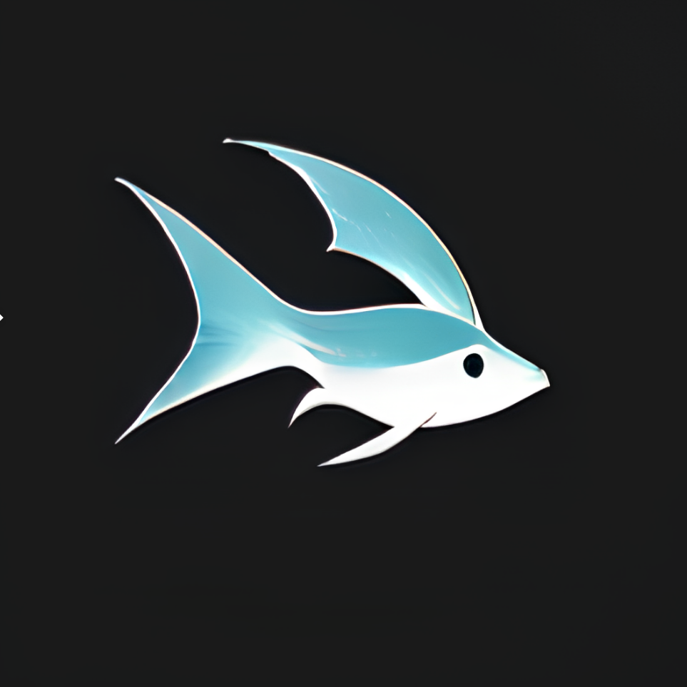

# GPT Shell

<div align="center">
  
  

  <h1>GPT Shell</h1>
  <p><strong>专业的终端 LLM 交互助手</strong></p>

  [](https://github.com/wangenius/gpt-shell/stargazers)
  [](https://github.com/wangenius/gpt-shell/blob/master/LICENSE)
  
  [](https://github.com/wangenius/gpt-shell/pulls)
  

  <p align="center">
    <a href="#核心特性">核心特性</a> •
    <a href="#快速开始">快速开始</a> •
    <a href="#使用指南">使用指南</a> •
    <a href="#高级配置">高级配置</a>
  </p>

</div>

## 📖 简介

GPT Shell 是一款基于 Rust 开发的强大终端 AI 助手，让您能够直接在命令行中与各种大语言模型（LLMs）进行交互。它不仅提供了简洁的界面，还支持多种 AI 服务商，是开发者和终端用户的理想选择。无论您是需要编程帮助、文本创作，还是日常任务自动化，GPT Shell 都能为您提供专业的支持。

## 🌟 核心特性

<table>
<tr>
<td>

### 🔌 基础功能
- **多模型支持**：兼容 OpenAI、DeepSeek、通义、智谱等服务商
- **自定义端点**：支持配置私有部署或其他兼容服务
- **实时响应**：基于 Stream API 的流式输出
- **角色预设**：快速切换不同场景的 AI 助手
- **命令别名**：支持单字符快捷指令
- **跨平台支持**：Windows、MacOS、Linux 全平台适配
- **自动更新**：内置版本检查和更新功能

</td>
<td>

### 🎯 使用体验
- **交互模式**：自然的对话交互体验
- **直接查询**：支持一次性快速提问
- **彩色输出**：优化的终端显示效果
- **上下文记忆**：自动维护对话历史
- **生成控制**：支持 Ctrl+C 随时中断
- **灵活配置**：支持环境变量和配置文件
- **JSON 模式**：支持结构化数据交互

</td>
</tr>
</table>

### 🤖 支持的服务商

- ✅ **OpenAI**：支持 GPT-3.5/4 等模型，完整的流式响应
- ✅ **DeepSeek**：支持 DeepSeek-Chat 等模型，自定义 API 端点
- ✅ **通义**：支持通义千问等模型，可配置模型参数
- ✅ **智谱**：支持 ChatGLM 等模型，灵活的接口适配
- ✅ 其他适配 OpenAI 通信格式的模型

## ⚡ 快速开始

### 安装方式

```powershell
# Windows PowerShell
irm https://raw.githubusercontent.com/wangenius/gpt-shell/refs/heads/master/install.ps1 | iex

# 其他平台安装方式请参考在线文档
```

### 命令行参数

```bash
gpt [选项] [提示词]

选项：
  -b, --bot <BOT>      使用指定的预设角色
  -a, --agent <AGENT>  使用指定的智能代理
  -h, --help          显示帮助信息
  -V, --version       显示版本信息

子命令：
  update              检查并安装更新
  config              配置管理
  bots                角色管理
```

### 基本命令

```bash
# 启动交互式会话
gpt

# 直接提问
gpt "如何使用 Docker？"

# 使用特定角色
gpt -b programmer "代码审查"

# 查看帮助
gpt --help
```

## 📚 使用指南

### 交互模式
```bash
gpt
> 你好
你好！有什么我可以帮你的吗？

> 什么是闭包？
闭包是一个能够访问自由变量的函数...
[按 Ctrl+C 可随时中断生成]

> exit
再见！
```

### 配置模型
```bash
# 添加模型
gpt config model add openai sk-xxxxxxxxxxxxxxxx

# 添加自定义模型
gpt config model add deepseek your-api-key \
  --url https://api.deepseek.com/v1/chat/completions \
  --model deepseek-chat

# 查看和切换模型
gpt config model list
gpt config model use deepseek
gpt config model remove openai
```

注意：`--url` 需要填写完整的 API 地址，如 `https://api.deepseek.com/v1/chat/completions`，而不是基础 URL。

### 角色管理
```bash
# 查看所有角色
gpt bots

# 添加自定义角色
gpt bots add reviewer -s "您是一位专业的代码审查专家"

# 管理角色别名
gpt bots alias set reviewer r
gpt bots alias list
gpt bots alias remove r
```

## 🤖 智能代理系统

GPT Shell 提供了强大的智能代理系统，基于 Rust 实现的高性能命令执行和状态管理：

- **系统提示词**：定义代理的角色和行为特征
- **环境变量**：配置系统环境变量用于命令执行
- **命令模板**：预定义常用命令模板
- **智能命令执行**：自动替换变量并执行命令
- **状态管理**：维护对话上下文和执行状态
- **并发控制**：支持异步操作和任务取消
- **标准化交互**：JSON 格式的请求响应

### 代理配置示例

```toml
name = "开发助手"
description = "专业的开发辅助工具"
system_prompt = "您是一位经验丰富的开发者"

[env]
editor = "code"
browser = "C:\\Program Files\\Google\\Chrome\\Application\\chrome.exe"

[templates]
open_file = "{{editor}} {{file}}"
open_browser = "start {{browser}} {{url}}"
```

## ⚙️ 高级配置

### 系统设置
```bash
# 查看配置
gpt config

# 修改设置
gpt config edit

# 更新系统提示词
gpt config system "您是一位专业开发者"

# 功能开关
gpt config stream true
```

### 配置存储
- 配置文件位置：`~/.gpt-shell/`
- API 密钥安全存储
- 自动管理会话历史
- 支持 .env 环境变量

### 技术特性
- **异步处理**：基于 tokio 的异步运行时
- **流式传输**：实时响应处理
- **内存安全**：Rust 保证的内存安全性
- **错误处理**：完善的错误处理机制
- **类型系统**：强类型保证的数据安全

## 🔒 安全最佳实践

- **API 密钥**：安全存储，避免版本控制
- **访问控制**：谨慎管理权限
- **成本管理**：监控 API 使用情况
- **数据隐私**：注意数据处理政策
- **更新维护**：及时更新工具和依赖

## 🤝 参与贡献

欢迎参与项目建设：

- 🐛 报告问题和漏洞
- 💡 提出新功能建议
- 🔧 提交代码改进
- 📖 完善项目文档
- 🌍 改进中文翻译

### 开发指南
1. 克隆项目并安装依赖
2. 遵循 Rust 编码规范
3. 编写测试用例
4. 提交 PR 前请确保通过所有测试

## 📄 开源协议

本项目采用 [MIT 协议](LICENSE) 开源。

---

<div align="center">
  
**[详细文档](https://github.com/wangenius/gpt-shell/wiki)** • 
**[问题反馈](https://github.com/wangenius/gpt-shell/issues)** • 
**[功能建议](https://github.com/wangenius/gpt-shell/issues)**

</div>

## 致谢

- [FREE-CHATGPT-API](https://github.com/popjane/free_chatgpt_api)


